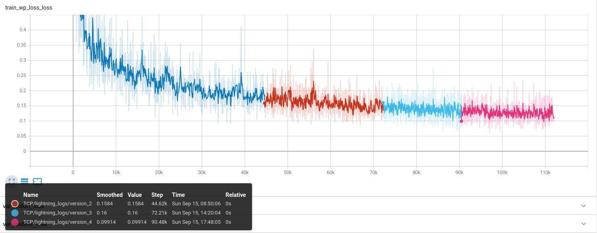

# Reproducing Results: TCP - Trajectory-guided Control Prediction for End-to-end Autonomous Driving: A Simple yet Strong Baseline

I have reproduced the results of the TCP paper and have made the checkpoints public!
This model was trained on an Lenovo Legion laptop with an Intel i7-12700H (20 threads) and NVIDIA GeForce RTX 3070 Mobile GPU with 8 GB VRAM. The model was trained upto epoch 20.





```
Average Score Composed: 40.24
Average Score Penalty: 0.67
Average Score Route: 65.82
```


# TCP


> Trajectory-guided Control Prediction for End-to-end Autonomous Driving: A Simple yet Strong Baseline  
> [Penghao Wu*](https://scholar.google.com/citations?user=9mssd5EAAAAJ&hl=en), [Xiaosong Jia*](https://jiaxiaosong1002.github.io/), [Li Chen*](https://scholar.google.com/citations?user=ulZxvY0AAAAJ&hl=en), [Junchi Yan](https://thinklab.sjtu.edu.cn/), [Hongyang Li](https://lihongyang.info/), [Yu Qiao](http://mmlab.siat.ac.cn/yuqiao/)    
>  - [arXiv Paper](https://arxiv.org/abs/2206.08129), NeurIPS 2022
>  - [Blog in Chinese](https://zhuanlan.zhihu.com/p/532665469)

	
[](https://paperswithcode.com/sota/autonomous-driving-on-carla-leaderboard?p=trajectory-guided-control-prediction-for-end)

This repository contains the code for the paper [Trajectory-guided Control Prediction for End-to-end Autonomous Driving: A Simple yet Strong Baseline](https://arxiv.org/abs/2206.08129).


TCP is a simple unified framework to combine trajectory and control prediction for end-to-end autonomous driving.  By time of release in June 17 2022, our method achieves new state-of-the-art on [CARLA AD Leaderboard](https://leaderboard.carla.org/leaderboard/), in which we rank the **first** in terms of the Driving Score and Infraction Penalty using only a single camera as input. 


## Setup
Clone this repo and build the environment

```
git clone https://github.com/OpenPerceptionX/TCP.git
cd TCP
conda env create -f environment.yml --name TCP
conda activate TCP
```

``` 
export PYTHONPATH=$PYTHONPATH:PATH_TO_TCP
```

Download and setup CARLA 0.9.10.1
```
mkdir carla
cd carla
wget -c https://tiny.carla.org/carla-0-9-10-1-linux -O CARLA_0.9.10.1.tar.gz
wget -c https://tiny.carla.org/additional-maps-0-9-10-1-linux -O AdditionalMaps_0.9.10.1.tar.gz
tar -xvzf CARLA_0.9.10.1.tar.gz
mv CARLA_0.9.10.1.tar.gz Import/
./ImportAssets.sh
cd ..
pip install carla==0.9.12
```

## Dataset

Download our dataset through [Huggingface](https://huggingface.co/datasets/craigwu/tcp_carla_data) (combine the part with command `cat tcp_carla_data_part_* > tcp_carla_data.zip`) or [GoogleDrive](https://drive.google.com/file/d/1HZxlSZ_wUVWkNTWMXXcSQxtYdT7GogSm/view?usp=sharing) or [BaiduYun](https://pan.baidu.com/s/11xBZwAWQ3WxQXecuuPoexQ) (提取码 8174). The total size of our dataset is around 115G, make sure you have enough space.

## Pretrained Checkpoint

You can download the checkpoints from this [Google Drive Link](https://drive.google.com/drive/u/0/folders/1w380rIOiW-EKY2DtbzkEedqVW5NIsPK6) and place them at `ckpts/`.

```
(TCP)$ tree ckpts/
ckpts/
├── epoch_07.pth
├── epoch_11.pth
├── epoch_12.pth
├── epoch_16.pth
└── epoch_20.pth

0 directories, 5 files
```

## Training
First, set the dataset path in ``TCP/config.py`` in `root_dir_all`.
Training:
```
python -m TCP.train
python -m TCP.train --resume_from_checkpoint ckpts/epoch_20.pth
```

## Data Generation
First, launch the carla server,
```
cd CARLA_ROOT
./CarlaUE4.sh --world-port=2000 -quality-level=Low
```
Set the carla path, routes file, scenario file, and data path for data generation in ``leaderboard/scripts/data_collection.sh``.

Start data collection

```
sh leaderboard/scripts/data_collection.sh
```
After the data collecting process, run `tools/filter_data.py` and `tools/gen_data.py` to filter out invalid data and pack the data for training.

## Evaluation
First, launch the carla server,
```
cd CARLA_ROOT
./CarlaUE4.sh --world-port=2000 -quality-level=Low
```
Set the carla path, routes file, scenario file, model ckpt, and data path for evaluation in ``leaderboard/scripts/run_evaluation.sh``.

Start the evaluation

```
sh leaderboard/scripts/run_evaluation.sh
```

## Citation

If you find our repo or our paper useful, please use the following citation:

```
@inproceedings{wu2022trajectoryguided,
 title={Trajectory-guided Control Prediction for End-to-end Autonomous Driving: A Simple yet Strong Baseline}, 
 author={Penghao Wu and Xiaosong Jia and Li Chen and Junchi Yan and Hongyang Li and Yu Qiao},
 booktitle={NeurIPS},
 year={2022},
}
```

## License
All code within this repository is under [Apache License 2.0](https://www.apache.org/licenses/LICENSE-2.0).

## Acknowledgements

Our code is based on several repositories:
- [Transfuser](https://github.com/autonomousvision/transfuser)
- [Roach](https://github.com/zhejz/carla-roach)
- [CARLA Leaderboard](https://github.com/carla-simulator/leaderboard)
- [Scenario Runner](https://github.com/carla-simulator/scenario_runner)

